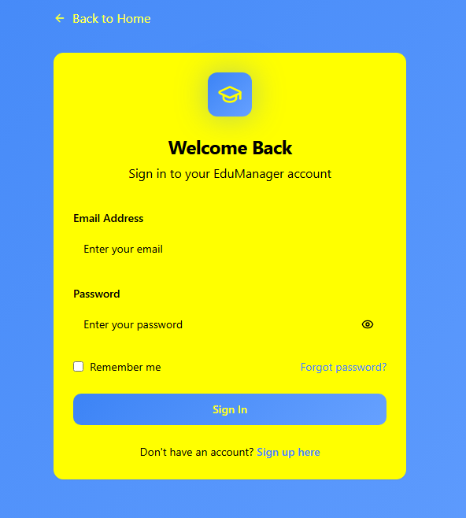

# NeoLearn-school-management-system-documentation
Main documentation and links for the AI-powered school management system.


# 🏫 NeoLearn School Management System (AI-Powered)

_A smart, scalable solution for managing school operations with AI-powered insights, built for SDG 4: Quality Education._

---

## 📚 Table of Contents
- [Overview](#overview)
- [Features](#features)
- [Architecture](#architecture)
- [Tech Stack](#tech-stack)
- [AI Integration](#ai-integration)
- [Prompt Engineering](#prompt-engineering)
- [Database Structure](#database-structure)
- [Screenshots](#screenshots)
- [Setup Instructions](#setup-instructions)
- [Future Improvements](#future-improvements)
- [Project Repositories](#project-repositories)
- [Team](#team)

---

## ✅ Overview
Managing school operations like timetables, attendance, and performance can be time-consuming and prone to errors. Our **School Management System** automates these processes and introduces an **AI-powered query feature** that allows users to ask natural-language questions such as:

- *“Who is absent today?”*
- *“When is the next Math class?”*
- *“Show the top 3 students in Math this term.”*

This system is built to **improve efficiency and accessibility** in schools, aligning with **SDG 4: Quality Education**.

---

## 🔑 Features
- **User Management**: Admin, Teacher, Student roles with login functionality.
- **Timetable Management**: Create, view, manage, and optimize class schedules.
- **Attendance Tracking**: Teachers can mark daily attendance with real-time notifications and comprehensive reporting for teachers and parents.
- **Performance Analytics**: Track student progress with detailed analytics, grade management, and personalized learning insights.
- **AI Query Engine**: Natural language queries to analyze school data and get actionable recommendations for improved outcomes.
  - Examples:
    - “Who is absent today?”
    - “When is the next Science class?”
    - “Top students in Math this term.”

---

## 🏗 Architecture

```text
                  +----------------------+
                  |   User Interface     |
                  |      (Frontend)      |
                  +----------+-----------+
                             |
                             v
                  +----------------------+
                  | Application Logic    |
                  |      (Backend)       |
                  +----------+-----------+
                             |
      +----------------------+-----------------------+
      |                      |                       |
      v                      v                       v
+-------------+     +------------------+     +----------------------+
|   Database  |     | AI Query Engine  |     | Authentication &     |
|    Layer    |     |  (NLP + Reports) |     |     Security         |
+-------------+     +------------------+     +----------------------+

                             |
                             v
                  +----------------------+
                  | Deployment &         |
                  | Infrastructure       |
                  +----------------------+

```
---

## ⚙️ Tech Stack
- **Frontend**: HTML5, CSS3, JavaScript, React
- **Backend**: Python (flask)
- **Database**: MySQL
- **AI Integration**: Hugging Face API (Language Model for Natural-Language Queries)
- **Development Tools**: Lovable
- **Hosting**: bolt.new
- **Monetization**: IntaSend

---

## 🤖 AI Integration
Our AI module enables **natural-language querying**:
1. The user enters a question (e.g., “Who is absent today?”).
2. AI interprets the question.
3. The backend translates it into an SQL query.
4. Results are formatted and returned to the user.

### Example Queries:
- **Attendance**: “Who is absent today?”
- **Schedule**: “When is the next Math class?”
- **Performance**: “Show top 3 students in Science this term.”

---

## ✍️ Prompt Engineering

Prompt engineering was central to how we built the School Management System. Since we used **Lovable** and **Supabase**, well-structured prompts helped us generate clean frontend scaffolding, database schemas, and integrate the AI Query Engine.

### Example Prompt Used

Below is one of the actual prompts our team used to scaffold the landing page and core frontend:

```text
Build the landing page and basic frontend scaffolding for a School Management System designed for middle and high schools. This system will eventually manage timetables, attendance, student performance, and include an AI-powered query feature. 

📦 Deliverables
A responsive landing page with:
- Project title & tagline
- Navigation menu
- Brief overview of features/modules
- Call-to-action buttons (e.g., Login, Get Started)
- Clean and modern UI (mobile- and tablet-friendly)

Scaffold pages/components for:
- Dashboard (placeholder for timetable, attendance, performance)
- Login & Register
- AI Query Box section
- Placeholder components for "Timetable", "Attendance", "Performance"

💡 General Theme and Design
- Clean, academic UI
- Responsive layout using CSS Grid or Flexbox
- Use HTML5, CSS3, and vanilla JavaScript only.
- Icon-friendly (use Font Awesome or Heroicons)
- Light mode / modern interface
- Use real-looking mock data where helpful
```

This prompt gave us:

* A responsive **landing page** with hero section, features list, and CTA buttons.
* **Login/Register pages** with placeholder forms.
* A **dashboard** scaffold with sidebar navigation.
* A working **AI Query Box** placeholder ready for backend integration.
* A suggested **folder structure** that made collaboration easier.

### Why This Prompt Worked

* It was **specific** (outlined exact deliverables like pages, components, folder structure).
* It was **context-aware** (highlighted this was for a School Management System with AI features).
* It gave the AI **design constraints** (HTML5, CSS3, vanilla JS, responsive, academic theme).
* It included **future-readiness** (comments and hooks for easy backend integration with Supabase).

### Iteration Process

We didn’t just write one prompt and accept the output — we refined prompts when:

* Layouts needed better responsiveness.
* Components were missing details (like placeholder data).
* Integration points with Supabase required clear data attributes or IDs.

By iterating prompts, we improved the generated output until it matched our design vision and hackathon goals.


---

## 🗄 Database Structure
| Table       | Columns                                                              |
|-------------|----------------------------------------------------------------------|
| Users       | id, name, role, email, password                                      |
| Student     | id, first_name, last_name, class, roll_no                            |
| Teacher     | id, first_name, last_name, subject                                   |
| timetables  | id, class, day_of_week, start_time, end_time, subject, teacher_id    |
| attendance  | id, student_id, status, note                                         |
| Performance | id, student_id, subject, term, score, max_score                      |

---

## 🖼 Screenshots
*(Add screenshots of the UI here after development.)*



---


## 🛠 Setup Instructions

Follow these steps to run the project locally:

### 1. Clone the repository

```bash
git clone <repo-url>
cd school-management-system
```

### 2. Install dependencies

This project was scaffolded with **Lovable** and uses a **Supabase backend**.

```bash
npm install
```

### 3. Configure environment variables

Create a `.env` file in the project root and add your Supabase credentials (from your Supabase project settings):

```env
SUPABASE_URL=<your-supabase-url>
SUPABASE_ANON_KEY=<your-supabase-anon-key>
```

### 4. Run the development server

```bash
npm run dev
```

### 5. Access the app in your browser

```
http://localhost:3000/
```

---

### 🌐 Live Demo

[Click here to view the deployed app](https://smarted-solutions-ne-kyas.bolt.host/)


---

## 🚀 Future Improvements

Advanced analytics dashboards.

AI-powered grading and performance prediction.

Multi-language support.

Mobile app version.


---

## 🔗 Project Repositories
- [Frontend Repository](https://github.com/SmartEd-Solutions/NeoLearn-Frontend.git)  
- [Backend Repository](https://github.com/SmartEd-Solutions/backend.git)  
- [API Repository](https://github.com/SmartEd-Solutions/API.git)  

---

## 👨‍💻 Team

[Brian Ali] – Frontend Developer

[Obuye Emmanuel chukwuemeke] – Backend Developer & Database

[Eunice Fagbemide] – AI Integration

[Cecilia Thuo] – Testing

[Eunice Ohilebo] – Documentation & Pitch


